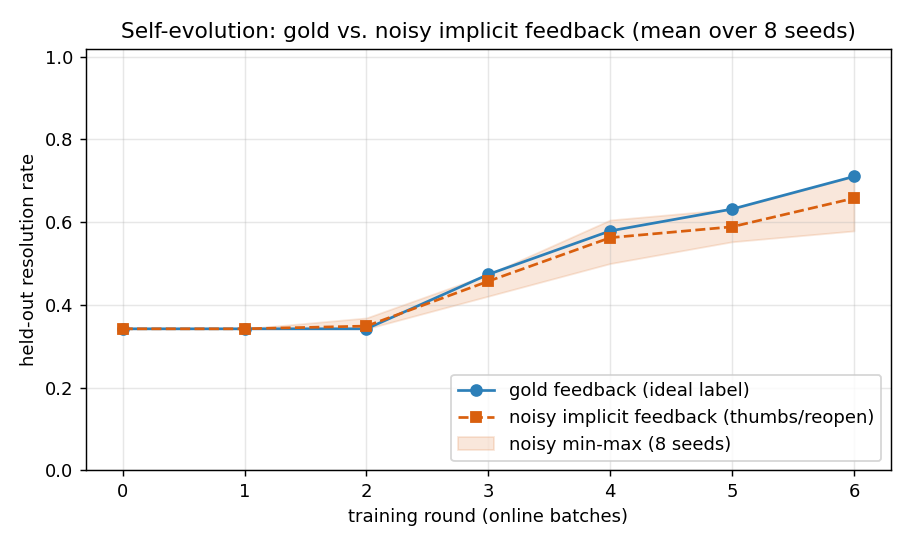

# 噪声/隐式反馈也能驱动自进化

**面试质疑**：线上没有 gold label，自进化机制还成立吗？

**实验**：把 gold 反馈换成线上真实存在的隐式/噪声信号(点踩 / reopen / 点赞 / 已解决)，用固定 seed 的确定性噪声模拟器(假阳率 p_fp=0.15、假阴率 p_fn=0.2)，经 `FeedbackProcessor` 转待复盘 → 模拟人审补全 resolution → `scrub_case` 脱敏入经验池，再跑同一套逐轮进化闭环。两条件除「什么工单进经验池」外完全一致。

为避免单个 seed 的偶然性，对 **8 个 seed** ([0, 1, 2, 3, 4, 5, 6, 7]) 各跑一遍并取均值；held-out eval 共 38 条同组改写问题(测的是泛化，不是背 eval 文本)。

## 核心数字(多 seed 均值)

| 条件 | 冷启动解决率 | 最终解决率 | 绝对增益 |
|---|---|---|---|
| gold(理想反馈) | 0.342 | 0.711 | +0.368 |
| noisy(隐式反馈) | 0.342 | 0.658 | +0.316 |

- **noisy 最终解决率 = gold 的 92.6%**(各 seed 区间 81.5% ~ 100.0%)。
- noisy 的**多 seed 均值曲线单调不降：是**；逐 seed 看 **7/8** 个 seed 个体也严格单调(个别 seed 因噪声 case 偶发单轮回撤，均值后被抹平)。
- 噪声造成的反馈污染(全部 seed 累加)：工单 304，假阳(满意却点踩，无害冗余) 19，假阴(没解决却漏标，**永久学不到**) 33，真负正确入池 159，实际入经验池 178。

## 逐轮曲线(resolution_rate，多 seed 均值)

| round | gold | noisy (mean) | noisy (min~max) |
|---|---|---|---|
| 0 | 0.342 | 0.342 | 0.342~0.342 |
| 1 | 0.342 | 0.342 | 0.342~0.342 |
| 2 | 0.342 | 0.349 | 0.342~0.368 |
| 3 | 0.474 | 0.457 | 0.421~0.474 |
| 4 | 0.579 | 0.562 | 0.500~0.605 |
| 5 | 0.632 | 0.589 | 0.553~0.632 |
| 6 | 0.711 | 0.658 | 0.579~0.711 |

## 结论 / 面试话术

> 我们做了离线弱监督消融：把 gold 反馈换成线上真实的隐式信号(点踩/reopen，带 15% 假阳、20% 假阴噪声)，跨 8 个 seed，自进化闭环依然**均值曲线单调爬升**(7/8 个 seed 个体严格单调)，最终解决率平均达到 gold 监督的 **93%**——假阴让部分失败案例永久学不到、进化变慢、上限略低，假阳只是引入无害的冗余正例；但机制本身不依赖 gold label。线上靠隐式反馈触发待复盘 + 轻量人审补全 resolution + 入库脱敏/治理，就能在没有标准答案的环境下持续进化。
